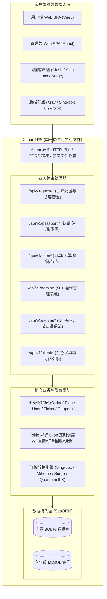

<div align="center">

# ⚡ Xboard-RS

**下一代云原生网络资源加速与聚合运营面板 · 100% 纯 Rust 原生构建**

[](https://www.rust-lang.org/)
[](LICENSE)
[](https://github.com/)
[](https://github.com/)
[](Dockerfile)
[](README.md)

<p align="center">
  <a href="#-核心性能革新与对比">性能对比</a> •
  <a href="#-核心特性">核心特性</a> •
  <a href="#-系统架构拓扑">系统架构</a> •
  <a href="#-快速上手">快速上手</a> •
  <a href="#-运行模式说明">运行模式</a> •
  <a href="#-环境变量配置">环境变量</a> •
  <a href="./docs/API_FRONTEND.md">前端对接手册</a>
</p>

---

</div>

## 📖 项目简介

**Xboard-RS** 是将经典代理运营面板架构 **100% 重构为单一 Rust 原生二进制程序** 的企业级服务端。

在**前端（React 管理端 + Vue3 用户端）零改动**的前提下，完美兼容原有全部 REST API 协议、数据结构、节点 UniProxy 协议与订阅分发引擎。彻底告别传统堆栈中 PHP-FPM、Laravel Octane、Horizon、Supervisor、Nginx 等多进程拼凑的运维梦魇。

<div align="center">
  
  
</div>

---

## 🚀 核心性能革新与对比

| 指标维度 | 原 PHP 架构 (Laravel + Octane + Horizon) | **全新 Xboard-RS** | 提升效果 |
| :--- | :--- | :--- | :---: |
| **常驻内存 (RSS)** | ~750 MB – 1.2 GB | **~15 MB – 35 MB** | **内存占用立减 95% 以上 ⚡** |
| **启动耗时** | 3 ~ 8 秒 (多进程框架冷启动) | **< 30 毫秒** | **百倍极速冷启** |
| **部署依赖** | PHP 8.2, Swoole, Caddy, Redis, Supervisor, Composer | **单一可执行文件**（零外部运行时依赖） | **一个文件即可运行** |
| **容器镜像大小** | ~650 MB – 1.1 GB | **~25 MB** (基于 Alpine 最小化构建) | **节省 96% 存储空间** |
| **最低机型需求** | 至少 1GB – 2GB 内存（易发 OOM 崩溃） | **256MB / 512MB 微型 VPS 畅跑** | **硬件成本骤减** |
| **后台任务调度** | 依赖 Horizon 多进程与外部 Redis 队列 | **内置 Tokio 异步微秒级 Cron 调度器** | **零多进程堆叠浪费** |

---

## ✨ 核心特性

- ⚡ **单进程异步极致并发**：基于 Axum 0.8 与 Tokio 异步非阻塞事件驱动，轻松支撑上万节点与客户端实时长连接。
- 🎨 **双前端零感知无缝平替**：
  - **管理端**：React + Shadcn UI + TailwindCSS（支持 50+ 管理接口与动态安全后台路径）。
  - **用户端**：Vue3 + TypeScript + NaiveUI（支持动态配置注入与 SPA 路由自动回退）。
- 📡 **全协议高保真订阅引擎**：内置 Clash Meta (Mihomo)、Sing-box 1.8+、Surge、Shadowrocket、Quantumult X、Loon 与通用 Base64 订阅生成器。
- 🔌 **高并发节点管理与通信**：原生支持 UniProxy / V2 节点通信流、时段动态流量倍率扣减、在线设备精准去重与心跳追踪。
- 💳 **多支付网关与精算订单流**：支持易支付 (Epay)、支付宝当面付 (AlipayF2f)、Mgate、Stripe 及精细化套餐剩余价值升级折抵。
- ⏰ **自包含调度工作器**：流量自然月/周期重置、超时未支付订单自动回收、3天无理由分销佣金划转、日志轮换一体化集成。
- 🗄️ **双数据库驱动与自动迁移**：支持开箱即用零运维 SQLite，以及企业级高并发连接池 MySQL，冷启动自动建表（`auto_migrate`）。
- 🛡️ **内存与密码安全**：杜绝反序列化漏洞，全面兼容 Laravel 兼容版 `$2y$` Bcrypt 安全哈希与 Rustls 纯内存 TLS。

---

## 📐 系统架构拓扑



---

## 🛠️ 快速上手

### 1. Docker Compose 一键部署（推荐）

项目根目录下已提供精简的 [`compose.yaml`](./compose.yaml)：

```bash
# 启动服务
docker compose up -d
```

服务启动后自动完成数据库迁移建表，访问 `http://服务器IP:7001` 即可体验！

---

### 2. 裸机直接运行（单二进制，极简零环境依赖）

直接从 Release 下载或交叉编译出 `xboard-rs` 单二进制文件，上传到服务器：

```bash
# 赋予执行权限并直接启动（默认 SQLite 模式）
chmod +x xboard-rs
./xboard-rs
```

---

### 3. 本地编译与开发者运行

确保本地已安装 Rust 1.80+：

```bash
# 运行全量自动化测试（113 项全通过，0 警告）
cargo test

# 启动服务（服务将在 http://127.0.0.1:7001 监听）
cargo run --release
```

---

## 🖥️ 运行模式说明

Xboard-RS 专为不同硬件规模与业务场景设计，支持灵活切换运行拓扑：

| 模式分类 | 方案 | 环境变量配置 | 特性与适用场景 |
| :--- | :--- | :--- | :--- |
| **数据库** | **SQLite 模式**<br>*(开箱默认)* | `DB_CONNECTION=sqlite`<br>`DB_DATABASE=/data/xboard.db` | **零依赖单文件存储**，内存仅需 **15MB**，极简备份复制单个 `.db` 即可迁移，微型 VPS 最佳拍档。 |
| | **MySQL 模式**<br>*(企业级)* | `DB_CONNECTION=mysql`<br>`DB_HOST=127.0.0.1`<br>`DB_PORT=3306`<br>`DB_DATABASE=xboard`<br>`DB_USERNAME=root`<br>`DB_PASSWORD=secret` | **100% 数据表兼容**，支持直接挂接原 PHP 版现有数据库无缝平替升级；支持云数据库 RDS 与高并发连接池。 |
| **缓存** | **内置内存缓存**<br>*(默认推荐)* | *无需任何配置* | 基于 `tokio::sync::RwLock`，微秒级指针寻址，**免装 Redis**，大幅削减服务器驻留内存。 |
| | **Redis 分布式缓存** | `REDIS_HOST=127.0.0.1`<br>`REDIS_PORT=6379` | 支持多实例横向扩展与分布式节点限流。 |

---

## ⌨️ CLI 运维管理命令

二进制内置实用的开箱即用运维管理指令：

```bash
# 1. 快速创建或重置管理员账号与密码
./xboard-rs admin <管理员邮箱> <新密码>

# 2. 重置指定普通用户密码
./xboard-rs reset:password <用户邮箱> <新密码>
```

---

## 📂 项目目录结构

```text
Xboard/
├── .github/                # 自动化 CI 与 Docker 跨平台镜像发布流水线
│   └── workflows/          # ci.yml (单元测试与Clippy) / docker-publish.yml
├── docs/                   # 📚 完备文档库
│   ├── API_FRONTEND.md     # 🎨 纯前端自研 API 对接全量规范 (带代码示例)
│   ├── REFACTOR_PLAN.md    # 📋 阶段重构技术方案与 113 项验收详情
│   └── images/             # 架构图与界面演示图
├── public/                 # 🎨 管理端 React (Shadcn UI) 单页应用打包产物
├── theme/                  # 📱 用户端 Vue3 主题模板与静态资源
├── src/                    # 🦀 核心源码
│   ├── common/             # 统一响应载荷、全局错误处理与 AppState
│   ├── config/             # 环境变量与应用配置加载器
│   ├── entities/           # SeaORM 实体定义 (用户、订单、节点、设置等)
│   ├── handlers/           # HTTP 路由与控制器 (guest, passport, user, admin, server, web)
│   ├── payments/           # 支付网关驱动实现 (AlipayF2f, Epay, Mgate, Stripe)
│   ├── protocols/          # 全客户端订阅协议生成引擎 (Clash, Singbox, Surge, Loon, etc.)
│   ├── services/           # 核心业务服务与 Tokio 异步定时任务 Cron 调度器
│   ├── utils/              # 加密哈希、Laravel 2y Bcrypt 校验、CRC32b 算法
│   ├── lib.rs              # 模块导出库
│   └── main.rs             # 单体入口与 CLI 命令分发
├── tests/                  # 🧪 全量自动化集成测试套件 (113 项全通过)
├── .env.example            # ⚙️ 环境变量配置模板
├── compose.yaml            # 🐳 Docker Compose 容器编排配置
├── Dockerfile              # 🐳 轻量多阶段容器构建入口
├── Cargo.toml              # 🦀 项目依赖声明
├── LICENSE                 # 📜 MIT 开源协议
└── README.md
```

---

## ⚙️ 环境变量配置

支持在根目录下创建 `.env` 文件或直接在系统环境变量中定义：

| 变量名 | 默认值 | 作用说明 |
| :--- | :--- | :--- |
| `SERVER_HOST` | `0.0.0.0` | HTTP 服务监听地址 |
| `SERVER_PORT` | `7001` | HTTP 服务监听端口 |
| `APP_NAME` | `Xboard` | 站点名称 |
| `APP_KEY` | `base64:xboard_default_key_...` | 应用加密主密钥 |
| `APP_URL` | `http://127.0.0.1:7001` | 站点公网访问 URL |
| `DB_CONNECTION` | `sqlite` | 数据库类型 (`sqlite` 或 `mysql`) |
| `DB_DATABASE` | `/data/xboard.db` | SQLite 数据库路径 或 MySQL 数据库名 |
| `DB_HOST` | `127.0.0.1` | MySQL 连接地址（仅 MySQL 模式） |
| `DB_PORT` | `3306` | MySQL 端口（仅 MySQL 模式） |
| `DB_USERNAME` | `root` | MySQL 登录用户名 |
| `DB_PASSWORD` | `""` | MySQL 登录密码 |
| `REDIS_HOST` | 无（默认内存缓存） | Redis 连接主机（可选） |
| `REDIS_PORT` | `6379` | Redis 端口 |
| `RUST_LOG` | `xboard_rs=info,tower_http=info` | 日志输出级别 (`debug`, `info`, `warn`, `error`) |

---

## 🎨 前端自研与二次开发

本项目后端为 **100% 纯粹的 RESTful JSON API + Bearer Token 认证** 架构，并已配置全局 CORS 放行。你可以完全脱离现有界面，在任意新仓库中自由自研个性化用户端。

- 完整接口入参、返回模型与 Axios 请求封装范例，请参阅：👉 **[用户端前端自研开发与 API 对接手册](docs/API_FRONTEND.md)**

---

## 🧪 自动化测试套件体系

本项目在重构过程中严格推行 TDD 自动化测试驱动开发：

- **核心加解密与算法单元** (`src/lib.rs`)：Laravel 兼容 Bcrypt 加密校验、CRC32b 算法、在线设备清洗与去重算法 (19 tests)
- **阶段 0~2**：配置加载器、SeaORM 模型 CRUD、设置动态读写 (16 tests)
- **阶段 3~5**：11 种客户端订阅协议生成 Golden Test、UniProxy 通信流、动态路径解析 (21 tests)
- **阶段 6~8**：Passport 认证中心、用户中心工单与礼品卡、支付驱动与订单剩余价值折算 (22 tests)
- **阶段 9~11**：Admin 50+ 管理接口、后台 Cron 周期任务调度器、SPA 前端与静态资源托管 (25 tests)

**113 / 113 项测试全部通过**，`cargo clippy --all-targets -- -D warnings` **0 警告**。

---

## 📜 开源许可证

本项目基于 [MIT License](LICENSE) 开源发布。
